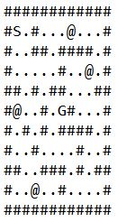
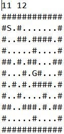
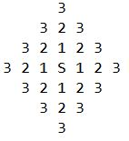

# ORIENTEERING PROBLEM : SOLUTION*

This was the second major program that I wrote in the college IIT-BHU in the year 2014. It was the problem statement of one company's campus placement.

### Question
Given a closed map. One has to move from a start point to an end point, passing through all the intermediate checkpoints with the shortest path.

### Example map:



### Map notations
```
#   :   Boundary
.   :   Open space
S   :   Start point
G   :   Goal point
@   :   Checkpoints
```

The solution is broken into three parts:
1. Finding shortest path between two given points in the map.
2. Finding optimized combination of all checkpoints.
3. Assembling the above two programs and finding the best route

## Part 1 
program to find shortest path between two given points in a map.

### Solution consists of two sub parts:
1. Finding the shortest distance between the given points.
2. Marking the path of shortest distance.

Program to find shortest distance between two points in a map

Question: Find the shortest distance a rat has to travel to get the cheese placed in a given map

Map:



Populating Algorithm (The name I gave):

In this method we find the target point and starts moving a step forward from that point. If the move is possible we mark those new steps. We then move from those new obtained points to the next possible step and repeat the procedure till we reach the goal point. 



The C++ program code for above solution:

[Program file link: src/shortest_distance.cpp](src/shortest_distance.cpp)

Functions used:
1. Input – Takes the input for the map.
2. Print - Use to print the solution on the screen.
3. Find – Search the map for a particular value and gives its location.
4. Mover – Looks the next forward step and if it not blocked returns its location
5. ShortestPathFinder – find the location of a point and then call the mover and marks the path

Path Finder:


Terminal Build
```
g++ -std=c++11 src/solution.cpp -o out/solution
```

Terminal Run
```
./out/solution
```